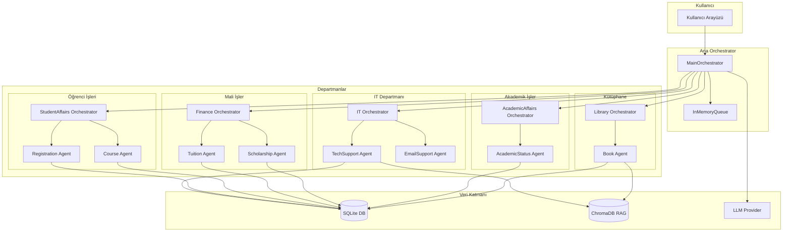
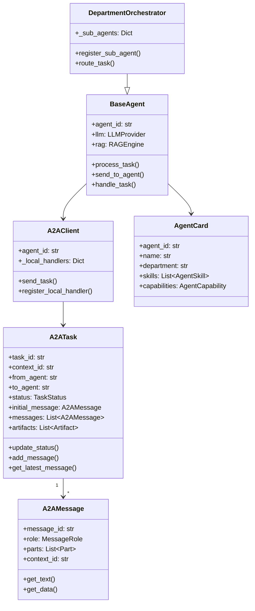
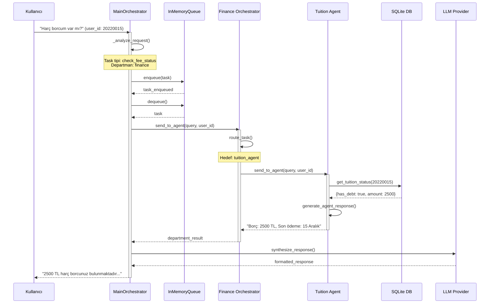
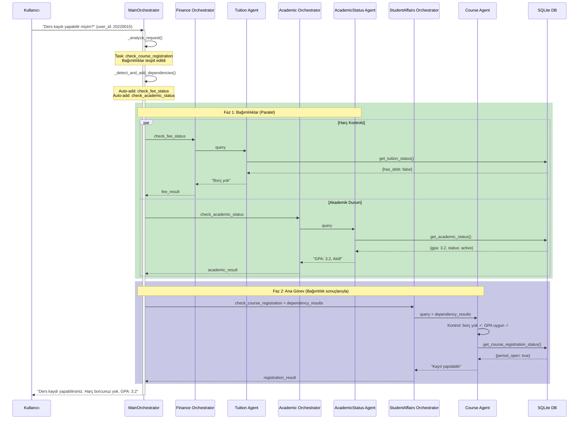
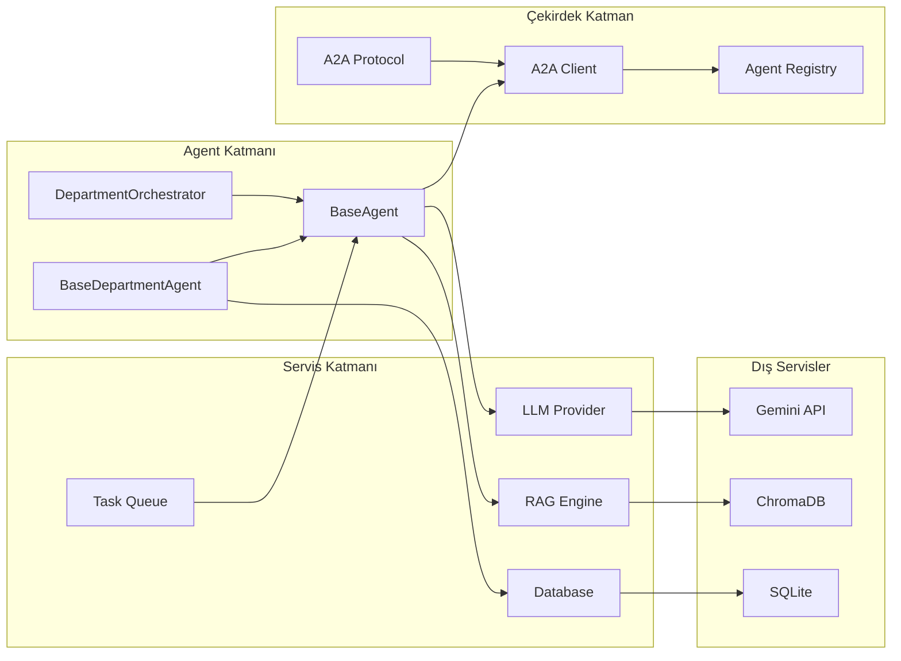
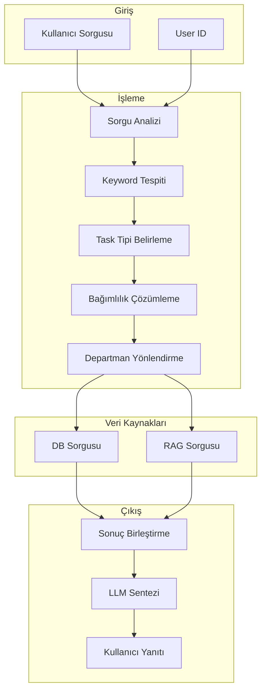

# Mermaid Diyagramları

## 1. Genel Mimari Yapısı

## 2. A2A Protokol Yapısı

## 3. Senaryo 1: Harç Borcu Sorgulama Akışı

## 4. Senaryo 2: Ders Kaydı (Bağımlılıklı) Akışı

## 5. Bileşen İlişki Diyagramı

## 6. Veri Akış Diyagramı

